# Лабораторная работа №2. Вариант 12
### Описание программы
---
Программа предназначена для управления данными о преподавателях университета с помощью графического интерфейса.

Основу интерфейс составляет таблица

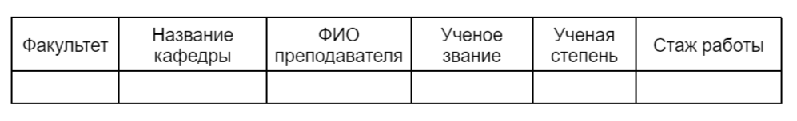
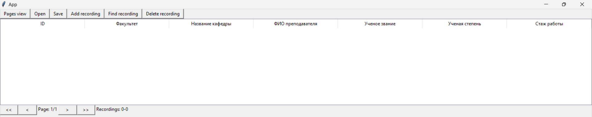

В ходе выполнения лабораторной работы были реализованы следующие функции:

- Добавление записи в таблицу(Add recording).

При нажатии на кнопку появлется новое диалоговое окно для добавления записи. Использовано поле со списком, в местах, где нужно выбрать вариант из предложенного списка(например выбор факультета).
  
| 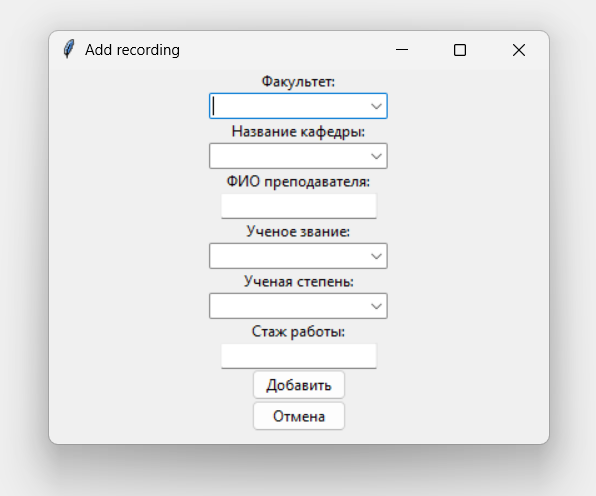 | 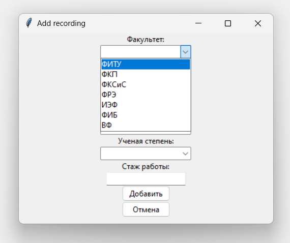 |
|:-----------------------------------:|:-----------------------------------:|

Также предусмотрена обработка ошибок при неправильном вводе или не заполнении всех полей

| 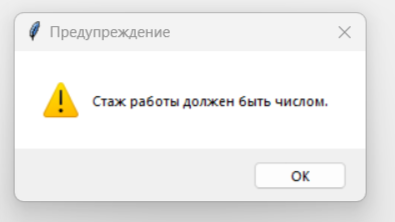 |  | 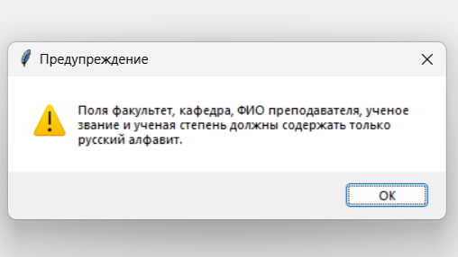 |
|:-----------------------------------:|:-----------------------------------:|:-----------------------------------:|

Успешное добавление записи; также сопровождается всплывающим окном, о успешности выполнения.

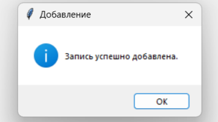
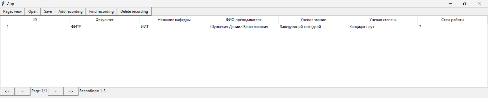

- Добавление списка записей в таблицу из XML файла(Open).
- Сохранение списка записей в XML файл(Save).

При нажатии на соответствующие кнопки, будет вызвано соответствующие окно открытия/сохранения XML файла.

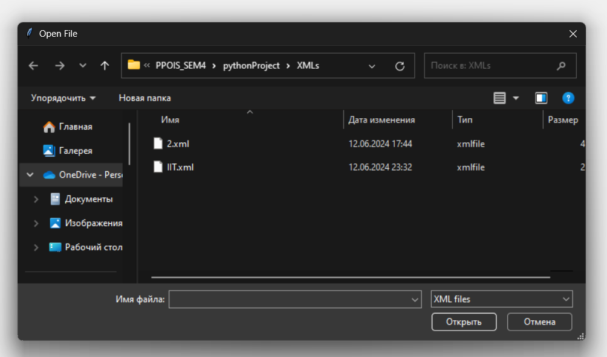

Успешное открытие XML файла и его же запись в другой XML файл выглядит так:

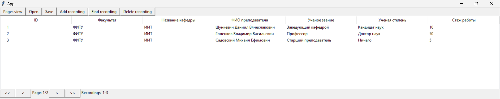

Как можно увидеть на иллюстрации выше по умолчанию количество записей на страницу - 3. Внизу окна можно увидеть изменившееся число страниц и индексы записей на текущей страницу.

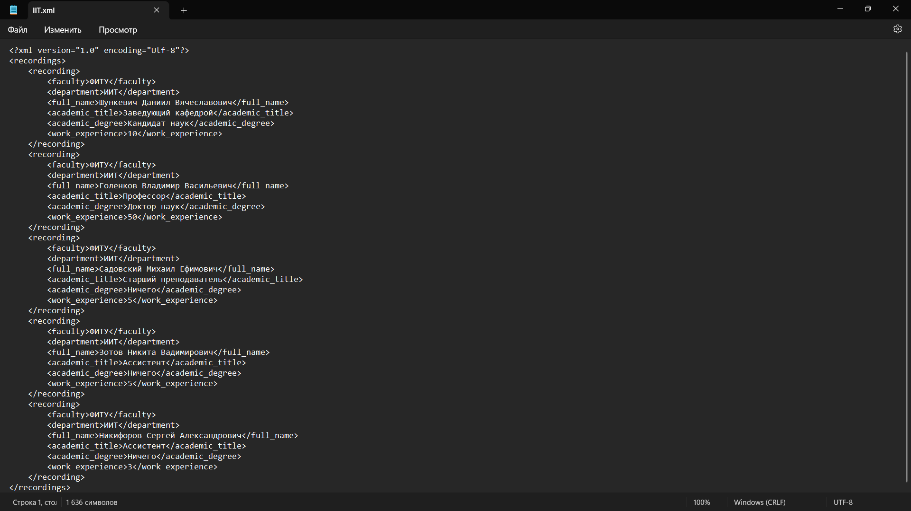

- Поиск записей по критериям(Find recording).

При нажатии на кнопку Find recording появлется новое окно с новым списком для записи результатов поиска. Критерий поиска выбирается в поле со списком, и на основе этого в левом углу программы появляются поля для ввода данных для критерия.

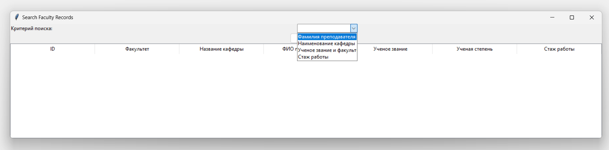
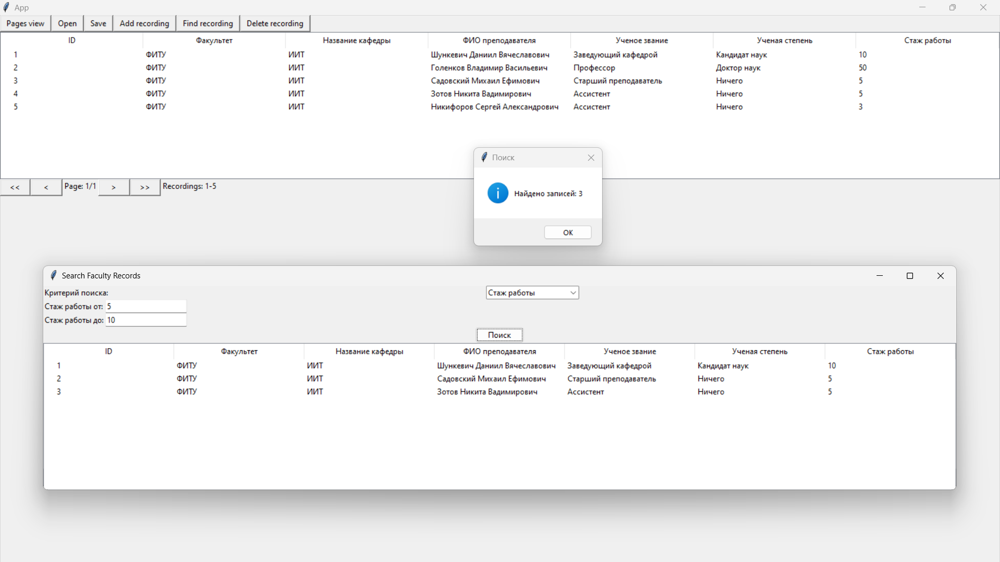

Также обработана ситуация в случае невведения данных для критерия или отсуствия записей, подходящих под критерий.

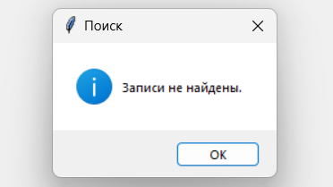

- Удаление записей по критериям(Delete recording).

Данная функция работает на основе предыдущей, но введение данных для критерия происходит в отдельном от поиска окне.

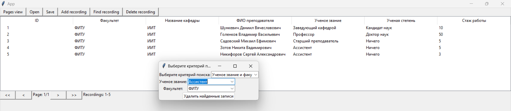

Также программа спрашивает у пользователя подтверждение на удаление найденных записей и выводит сообщение об успешном удалении, либо также, как и в функции поиска, выводит сообщение об отсуствии записей.

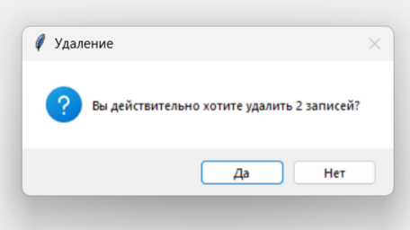

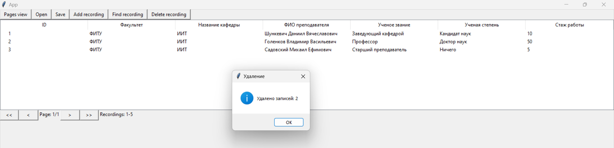

- Функция отображения конкретного числа записей на одну страницу(Pages view).

Нажав на кнопку Pages view можно изменить количество записей на страницу. Как можно видеть число записей на страницу изменилось на 5 и соответственно изменились показатели счётчиков внизу окна.

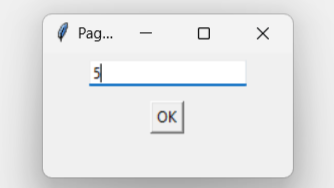

- Функции навигации по страницам(перейти на первую(<<)/предыдущую(<)/следующую(>)/последнюю страницу(>>)).

Данные функции объединены в одну группу из-за схожего функционала переключения страниц. Для демонстрации функции я изменил количество записей на страницу на 2. Внизу продемонстрированы 3 иллюстрации переключения страниц.

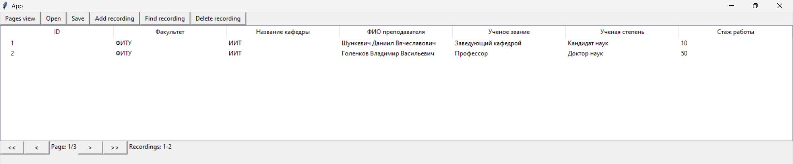
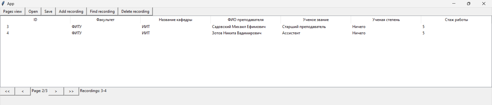
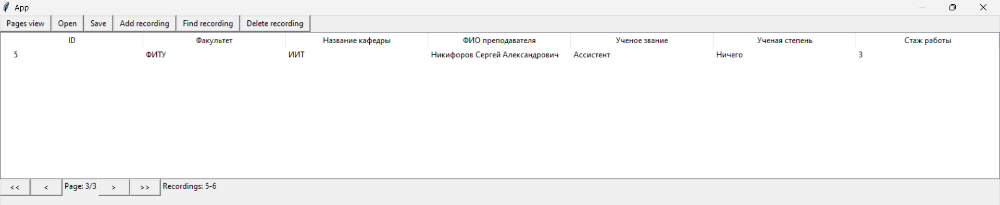

Как уже было показано, в окне программы отображается текущая страница, количество страниц(Page: 1/1) и диапазон индексов записей на текущей странице(Recordings: 0-0)
